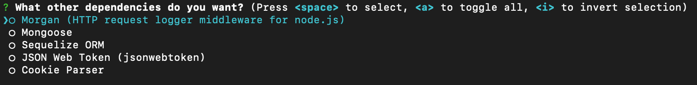
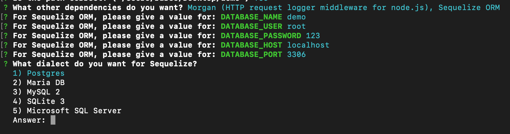
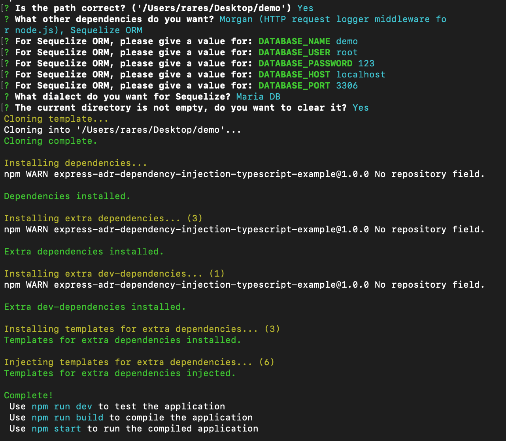

# ADR Express TypeScript


- [Documentation](https://raresail.github.io/adr-express-ts/)
- [GitHub](https://github.com/RaresAil/adr-express-ts)
- [NPM](https://www.npmjs.com/package/@adr-express-ts/core)

This package is a dependency injection for express with typescript using decorators and the [Action–Domain–Responder](https://en.wikipedia.org/wiki/Action–domain–responder) pattern.

## OAuth2 for ADR-Express-TS:

In the [Dependency Selector](#dependency-selector) you can select the OAuth2 module which comes with a template.

## Getting Started

#### Create

Use my CLI to create the application. Instead of "myFolderName" you can add "." to install it in the current directory.
Always use `npx` to use the latest version of the CLI.

```zsh
npx @adr-express-ts/cli create myFolderName
```

#### Path Check

You will get the following question:

```zsh
? Is the path correct? ('/my/path/to/application') (Y/n)
```

If the path is correct respond with `Y` or press `Enter`

#### Yarn Check

If you have Yarn installed, the CLI will ask if you want to use it, if you say `N` npm will be used.

```zsh
? Yarn was detected on your system, do you want to use Yarn? (Y/n)
```

#### Dependency Selector

For the next part you can choose if you need more dependencies (They will be automatically injected).


#### Dialect Selector (Only for Sequelize) and complete extra information

If you choose `Sequelize`, you will also be asked to choose which dialect you want and to complete the connection information.


#### Check if directory is empty

If the directory you want to create the application is not empty, you will be asked if you want to remove all files from it. If you don't remove the files the project will not be created.

```zsh
? The current directory is not empty, do you want to clear it? (y/N)
```

#### Finish

After everything is installed, you should see the following output.


## About Action–Domain–Responder

- The action takes HTTP requests (URLs and their methods) and uses that input to interact with the domain, after which it passes the domain's output to one and only one responder.
- The domain can modify state, interacting with storage and/or manipulating data as needed. It contains the business logic.
- The responder builds the entire HTTP response from the domain's output which is given to it by the action.
- The entity is the model for the database

## Project structure

```markdown
/src

# Here you define the tests, there are default tests defined.

- /**tests**

- /actions

# Here you define the route and the methods (get, post, put, delete)

# If you have /actions/v1/Action.ts, all the actions in v1 will have the prefix v1

# Are automatically injected!

- - action.ts

- /app

# Here you start the server (app.listen) and other checks before/after starting.

- - Server.ts

- /domain
- - /entities

# Here you define the entity (They are accessed with @Retrieve('Entity.NAME') or from your ORM)

# Are automatically injected!

- - - entity.ts

# Here you define the domain (They are accessed with @Retrieve('Domain.NAME'))

# Are automatically injected!

- - domain.ts

- /middlewares

# Here you define middlewares (as classes).

# You inject them manually

- - middleware.ts

/public

# In public (depends on the Configuration made in index.ts) you have the front-end,

# all routes point to index.html (i made it so it can work with React)

- - index.html

- /responders

# Here you define the domains (They are accessed with @Retrieve('Responder.NAME'))

# Are automatically injected!

- - responder.ts

# Here you inject classes, middlewares, variables, functions, server, router, etc.

# And you have to call Injector.ready(); when you finished all your injections.

- index.ts
```

## Configuration

```js
Injector.setup({
  rootFile: __filename,
  apiPrefix: '/api',
  debug: {
    log: console.log,
    error: console.error
  },
  staticFiles: {
    path: '/',
    directory: ['public']
  },
  errorHandler:
    undefined /* If undefined, the default error handler will be used. */,
  notFoundHandler:
    undefined /* If undefined, the default not found handler will be used. */
});
```

## Entity Model

This model is for Mongoose.

```js
@Inject
@Entity('User')
export default class UserEntity implements InjectedEntity {
  @Retrieve('Mongoose')
  private mongoose?: MongooseClass;

  async onLoad(): Promise<void> {
    if (!this.mongoose) {
      return;
    }

    const { ObjectId } = Schema as any;

    this.mongoose.model(
      'User',
      new Schema({
        id: ObjectId,
        email: {
          type: String,
          min: 3,
          max: 255,
          required: true
        },
        password: {
          type: String,
          min: 8,
          required: true
        }
      })
    );
  }
}
```

## Responder Model

```js
import { Inject, Responder } from '@adr-express-ts/core';
import { Response } from 'express';

@Inject
@Responder('Demo')
export default class DemoResponder {
  public success(res: Response) {
    return res.status(200).json({
      success: true
    });
  }

  public demo(res: Response, status: number, output: any) {
    return res.status(status).json(output);
  }
}
```

## Middleware Model

```js
import { Request, Response, NextFunction } from 'express';
import { Middleware } from '@adr-express-ts/core/lib/@types';
import { Inject } from '@adr-express-ts/core';

@Inject
export default class AuthenticationMiddleware implements Middleware {
  public async middleware(
    req: Request,
    res: Response,
    next: NextFunction
  ): Promise<any> {
    (req as any).myData = 'My custom request data!';
    return next();
  }
}
```

## Action Model

```js
import {
  Action,
  Get,
  Post,
  Put,
  Delete,
  Request,
  Response,
  Retrieve
} from '@adr-express-ts/core';
import {
  Request as ExpressRequest,
  Response as ExpressResponse
} from 'express';

import DemoResponder from '../responders/DemoResponder';
import DemoDomain from '../domain/DemoDomain';

@Action('/demo', ['MiddlewareHere'])
export default class DemoAction {
  @Retrieve('Responder.Demo')
  private responder?: DemoResponder;

  @Retrieve('Domain.Demo')
  private domain?: DemoDomain;

  @Get('/demo1', ['MiddlewareHere'])
  public findAll(
    @Request req: ExpressRequest,
    @Response res: ExpressResponse
  ): any {
    return res.send({
      success: true,
      test: (req as any).myData
    });
  }

  @Post()
  public async saveX(
    @Request req: ExpressRequest,
    @Response res: ExpressResponse
  ): Promise<any> {
    const dataFromDatabase = await this.domain!.test('parameter from action');
    return this.responder!.demo(res, 201, dataFromDatabase);
  }

  @Delete()
  public async deleteY(
    @Request req: ExpressRequest,
    @Response res: ExpressResponse
  ): Promise<any> {
    return this.responder!.success(res);
  }
}
```

## Domain Model

```js
import { Inject, Domain } from '@adr-express-ts/core';

@Inject
@Domain('Demo')
export default class DemoDomain {
  public async test(someParameter: string) {
    return {
      success: true,
      data: 'Data from database',
      someParameter
    };
  }
}
```

## Server.ts Example

```js
import { Configuration, Inject, Retrieve } from '@adr-express-ts/core';
import { InjectedClass } from '@adr-express-ts/core/lib/@types';
import { Application } from 'express';

@Inject
export default class Server implements InjectedClass {
  @Retrieve('ExpressApp')
  private application?: Application;

  @Retrieve('Configuration')
  private config?: Configuration;

  @Retrieve('Middlewares')
  private middlewares?: any;

  public async onReady(): Promise<void> {
    try {
      if (!this.application || !this.config) {
        return;
      }

      const log = this.config.debug.log ?? console.log;

      this.application.listen(4000, '0.0.0.0', async () => {
        log('Server started %o', '0.0.0.0:4000');
      });
    } catch (e) {
      const error = this.config?.debug.error ?? console.error;
      error(e);
    }
  }
}
```
